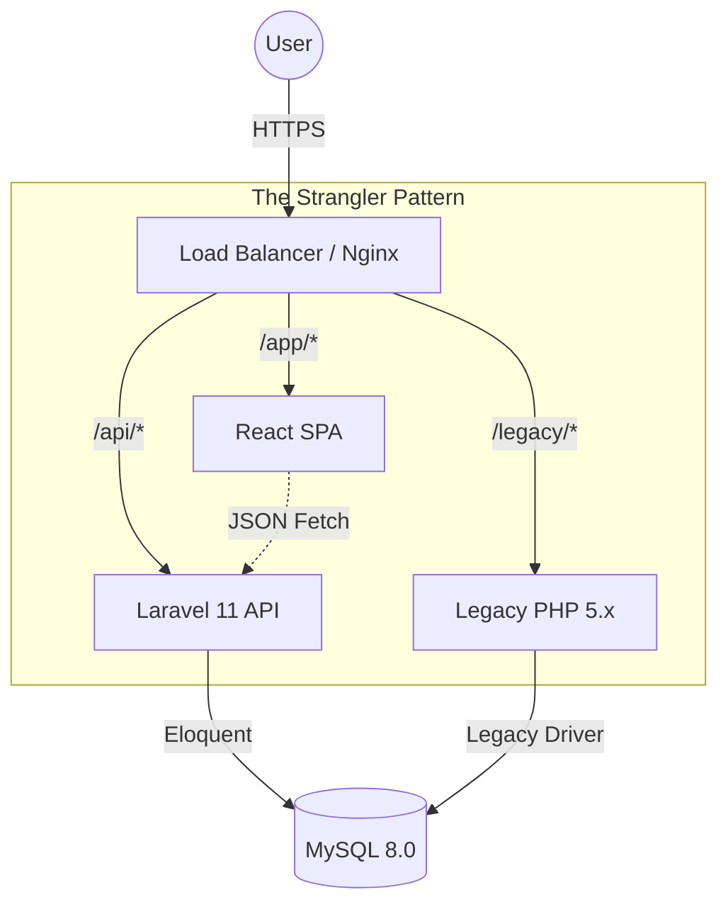

# 📐 The Architect's Blueprint: CIS 2026

> *"The first Matrix I designed was quite naturally perfect... but we are here to build the second."*

## 1. The High-Level Architecture (The Map)
We are moving from Monolith to **Hybrid Service**.

## 2. The Data Layer (The Foundation)
The Architect looks at the data first. The Code serves the Data.

| Legacy Table | New Model | Transformation |
|--------------|-----------|----------------|
| `users` (unsafe) | `User` | Add `email_verified_at`, `remember_token`. Hash passwords with Bcrypt. |
| `inventory_items` | `Item` | Add `soft_deletes` (Never delete history). Cast `price` to integer. |
| `tickets` | `Ticket` | Relate to `User` (User `hasMany` Tickets). |

## 3. The API Design (The Contract)
We define the "Language" the frontend speaks to the backend.

*   `GET /api/v1/items` - List all inventory (Paginated).
*   `POST /api/v1/tickets` - Create a new support ticket.
*   `GET /api/v1/stats/dashboard` - Heavy aggregation for charts.

## 4. The UI Component Tree (The Body)
Designed by **The Woman in Red**, standard by **The Architect**.

*   `App` (Root)
    *   `AuthProvider` (Security Context)
    *   `Layout` (Dashboard Shell)
        *   `Sidebar` (Navigation - Replaces Frameset)
        *   `TopBar` (User Profile, Search)
        *   `MainContent` (Dynamic Output)
            *   `InventoryTable` (Sortable, Filterable)
            *   `TicketForm` (Validation)

## 5. The Migration Plan (The Sequence)
1.  **Phase 1**: Setup Nginx and Laravel. Point `/api` to new code.
2.  **Phase 2**: Port the "Read-Only" views (Inventory List) to React.
3.  **Phase 3**: Port the "Write" logic (Create Ticket).
4.  **Phase 4**: Port Auth (Login).
5.  **Phase 5**: Kill the `OldApp`.

**This is the Design.** Mathematical. Precise. Inevitable.
